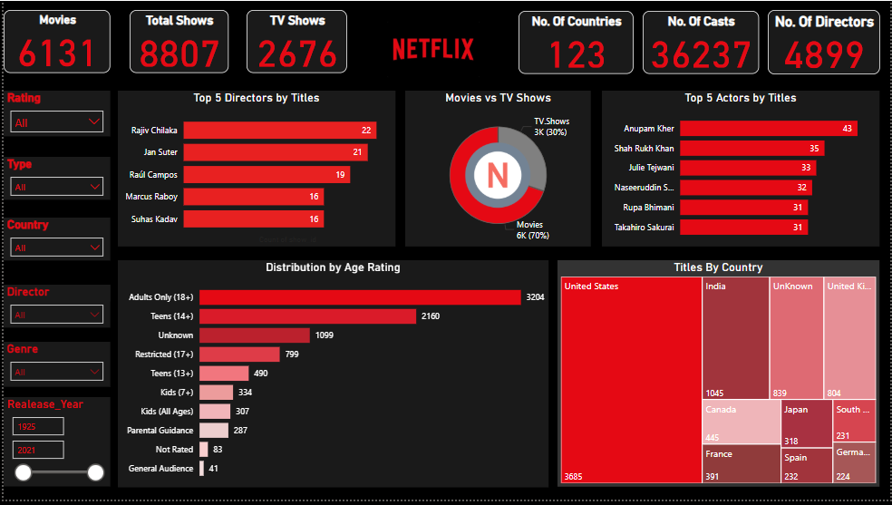
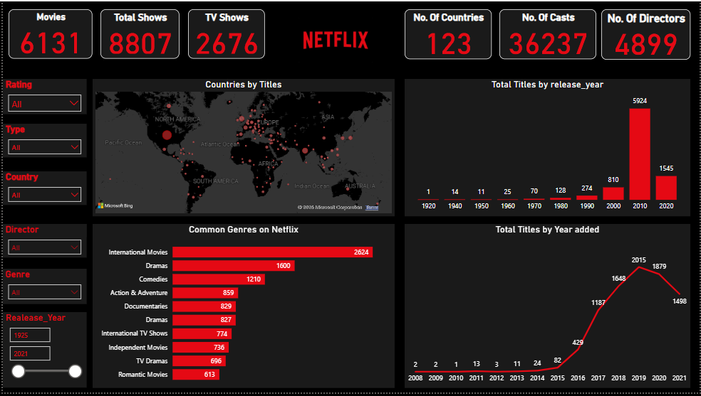

<h1 align="center">🎬 Netflix Dashboard - Power BI</h1>

  An interactive and insightful dashboard built using Microsoft Power BI to analyze Netflix content across different dimensions including titles, genres, ratings, countries, and release years.

---

## 📌 Overview

This Power BI dashboard provides a deep dive into Netflix's global catalog of shows and movies. It allows users to explore:

- Total number of Movies and TV Shows
- Top Directors and Actors by number of titles
- Titles by Country and Release Year
- Common Genres on Netflix
- Distribution by Age Rating
- Comparison between Movies vs TV Shows

---

## 📸 Dashboard Previews

### 🧭 View 1 – Overview & Key Insights

This dashboard view provides:
- Total number of **Movies**, **TV Shows**, and **Overall Titles**
- Total count of **Countries**, **Casts**, and **Directors**
- Top 5 **Directors** and **Actors** by number of titles
- Distribution of **Movies vs TV Shows**
- Analysis of **Age Ratings**
- Titles grouped by **Country**

---

### 🌍 View 2 – Global Distribution & Trends

This dashboard view focuses on:
- **World map** showing number of titles per country
- Total titles released over the years
- Common **Genres** across Netflix titles
- Trend of titles **added to Netflix** year by year

---

## 📁 Project Files

| File Name               | Description                              |
|------------------------|------------------------------------------|
| `new netflix.pbix`     | Power BI file containing the full report |
| `Netflix1.PNG`         | Screenshot of the main dashboard view    |
| `Netflix2.PNG`         | Screenshot of the geographical analysis  |

---

## 🛠 Tools & Technologies

- **Power BI Desktop**
- **Data Modeling & DAX**
- **Data Visualization**
- **Netflix Dataset (Public Source)**
- ---

## 📊 Dataset Source

The dataset used in this project was obtained from Kaggle:

🔗 [Netflix Shows Dataset – Kaggle](https://www.kaggle.com/datasets/shivamb/netflix-shows)

It includes details such as:
- Title name
- Type (Movie or TV Show)
- Cast, Director
- Country, Date Added, Release Year
- Rating, Duration, and more

---

## 📈 Insights

🔹 United States has the highest number of titles  
🔹 Adults (18+) is the dominant age category  
🔹 Most titles were released after 2010  
🔹 Top directors include *Rajiv Chilaka* and *Jan Suter*  
🔹 Top actors include *Anupam Kher* and *Shah Rukh Khan*

---

## 🙋‍♀️ About Me

**Amany Saeed**  
Junior Data Analyst | Power BI Enthusiast  
📫 Connect with me on [LinkedIn](https://www.linkedin.com/in/amany-saeed/) 

---

## ⭐ Show your support

If you found this project useful, please give it a ⭐ on GitHub.  
Feedback and suggestions are always welcome!

---

